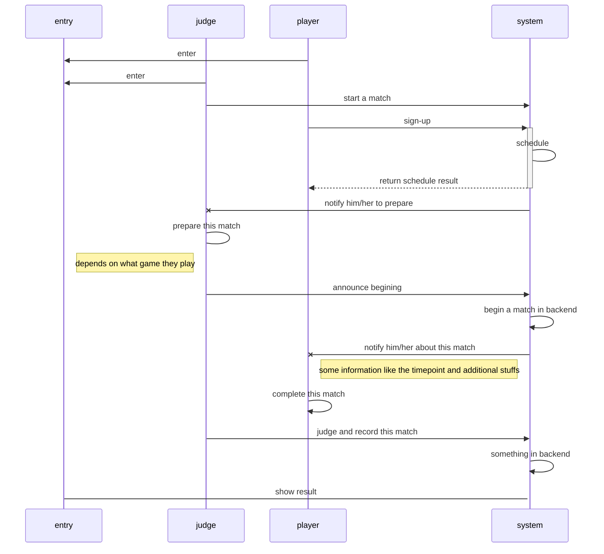

# Sequence Diagram of start a match

```mermaid
sequenceDiagram
	participant entry
	participant judge
	participant player
	participant system
	
	player ->> entry : enter
	judge ->> entry : enter
	judge ->> system : start a match
	player ->> + system : sign-up
	system -> system : schedule
	system -->> - player : return schedule result
	system -x judge : notify him/her to prepare
	judge -> judge : prepare this match
	Note left of judge : depends on what game they play
	judge ->> system : announce begining
	system ->> system : begin a match in backend
	system -x player : notify him/her about this match
	Note right of player : some information like the timepoint and additional stuffs
	player ->> player : complete this match
	judge ->> system : judge and record this match
	system ->> + system : something in backend
	system -> entry : show result
```

